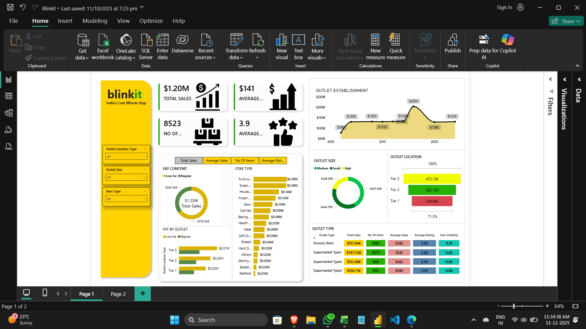

# Blinkit Sales Power BI Dashboard 📊

An interactive Power BI dashboard built to analyze Blinkit sales performance.  
Includes KPIs, customer insights, category trends, outlet insights, and time-based analysis using clean and modern visuals.

## 📊 Dashboard Preview

---

## 🔍 Key Features
- Total Sales, Total Items Sold, Average Rating (KPIs)
- Category-wise & Item-type performance
- Outlet-wise comparison (Tier, Size, Establishment Year)
- Yearly sales trends with line visuals
- Customer behavior insights
- Fully interactive slicers & filters for dynamic analysis

---

## 📈 Insights Highlights
- Medium-sized outlets generate the highest sales.
- Tier 3 outlets contribute the most revenue compared to Tier 1 & Tier 2.
- Regular items outperform low-fat items in total sales.
- Fruits & Snacks categories show strong revenue contribution.
- Customer ratings average around 3.9 across outlets.

---

## 🚀 Tools Used
- Power BI Desktop
- DAX Measures
- Power Query (ETL)
- Data Modeling & Relationships
- Custom Visual Formatting

---

## 📂 Files Included
- `Blinkit_Sales_Dashboard.pbix` – Full interactive dashboard
- `Blinkit_Sales_Dashboard.png` – Dashboard preview
